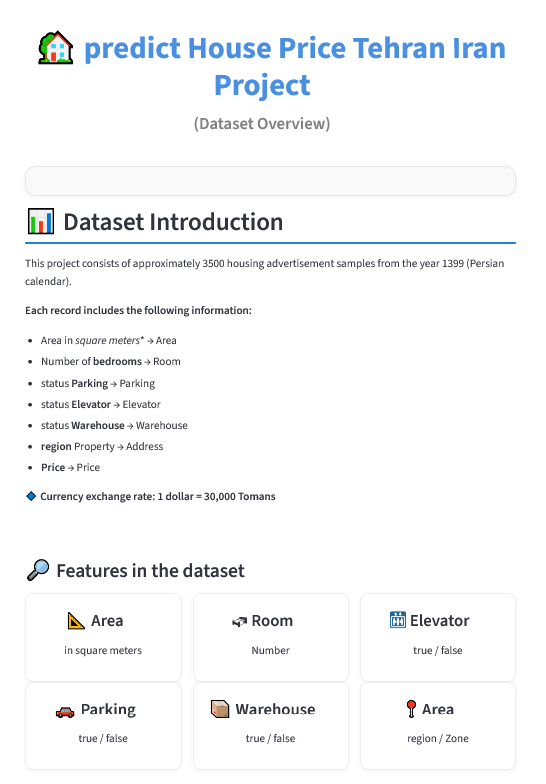
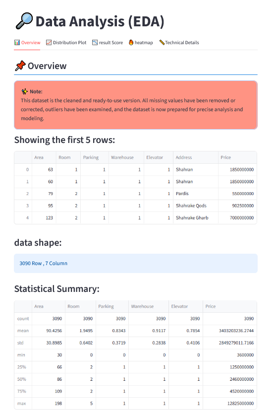
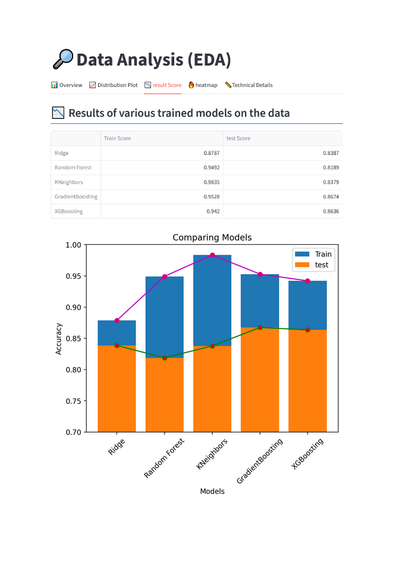
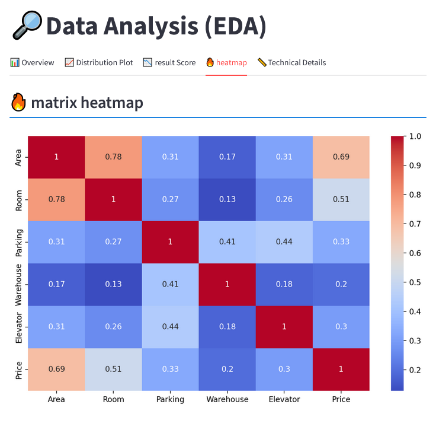
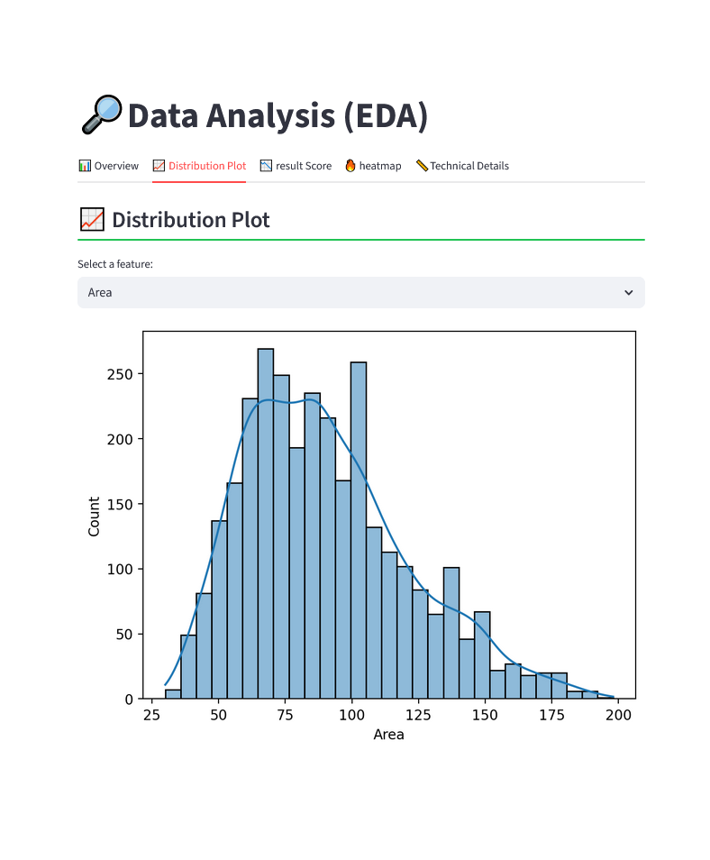
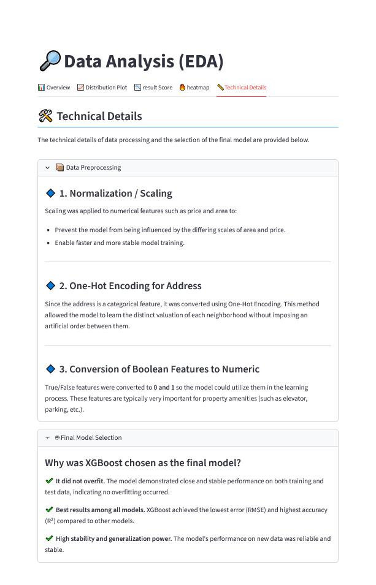
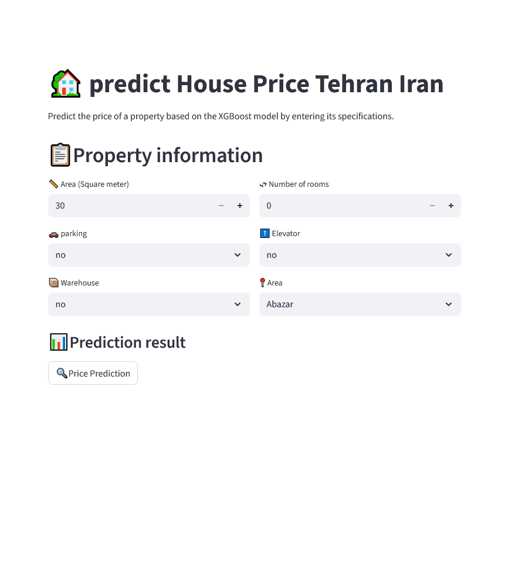

# 🏡 Project — House Price Prediction

An interactive WebApp for predicting house prices using XGBoost and Streamlit.
This application includes the following sections:
- Data Analysis
- Display of model results and hyperparameters
- House price prediction based on input features
- Technical details and explanations

## 🌐 Online WebApp Version

The cloud version is ready and requires no installation of Python or packages.
Simply click the link below and the app will open:

🔗 Live Demo: [https://yourapp.streamlit.app](https://house-price-tehran.streamlit.app)

Note: All Python libraries and the environment are managed by Streamlit Cloud; the user needs to do nothing.

---

## 🔎 Project Contents

- `page/` —  Streamlit web app (UI: Overview, EDA, Model Evaluation, Prediction)
- `data/` —  Cleaned dataset (the version used for the model)  
- `models/` — Saved models (e.g., `xgboost_model.pkl`)  
- `requirements.txt` — Dependencies required to run the webapp and model  
- `README.md`  — This file

---

### Dataset Description

- **Number of samples**: ~3,500 listings
- **Features**: Area (square meters), number of bedrooms, parking (yes/no), elevator (yes/no), storage, location, price (in Tomans and USD).
- **Conversion rate**: 1 USD = 30,000 Toman.
> Note: This is the cleaned version — missing values have been removed or corrected, and outliers have been reviewed. The dataset is ready for analysis and modeling.

---
## App Screenshots

  
  
  
  

  
  
  
  

> Notes: If the Streamlit app does not run properly on your system, you can refer to the screenshots above for a preview of the app functionality. 
---

## 🎯 Model Objective

- Problem type: Regression (price prediction)
- Main model: XGBoost Regressor
- Reported metrics: MAE, RMSE, R², and Residual / Actual vs. Predicted plots.

---
## Author

Parham Karkoubzadeh – [GitHub](https://github.com/Sirgic7)
